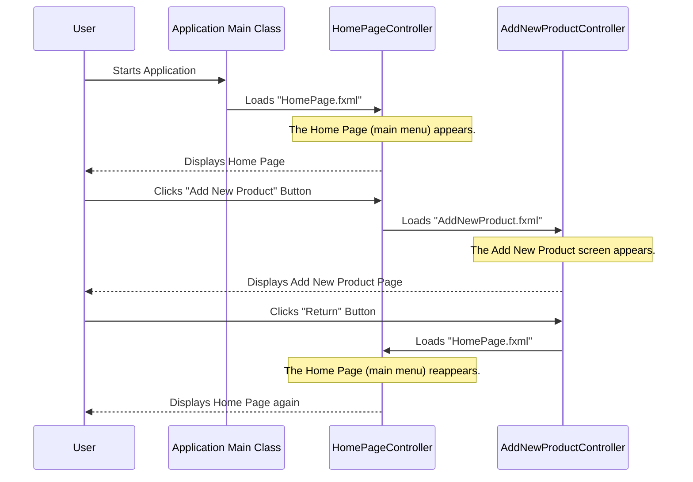

# Chapter 1: Application Entry Point & Navigation

Imagine walking into a brand new store. How do you know where the main entrance is? And once you're inside, how do you find the specific sections you need, like electronics or customer service? Our "Guarantee-Warranty Tracker" application works in a very similar way.

This chapter will teach you about two crucial ideas:
1.  **Application Entry Point:** How the application officially starts. Think of it as pushing open the front door of the store.
2.  **Navigation:** How you move between different parts of the application, like walking from the main lobby to the "Add New Product" department, and then finding your way back.

Understanding these concepts is the very first step to using and building any software!

## The Front Door: Starting the Application

Every application needs a starting point. In our "Guarantee-Warranty Tracker," this starting point is handled by a special class called `Main`. It's the first bit of code that runs, setting everything up for you to interact with the application.

### Use Case: How to start the application
When you launch the program, you want it to open up and show you the main menu. This is achieved by the `Main` class.

### Code Example: `Main.java`

```java
// File: Guarantee-Warranty Tracker/src/main_pkg/Main.java
package main_pkg;

import javafx.application.Application;
import javafx.fxml.FXMLLoader;
import javafx.scene.Parent;
import javafx.scene.Scene;
import javafx.stage.Stage;

public class Main extends Application {

    @Override
    public void start(Stage stage) throws Exception {
        // This loads the design for our Home Page from a file named "HomePage.fxml"
        Parent root = FXMLLoader.load(getClass().getResource("HomePage.fxml"));

        // A Scene is like a canvas that holds all the visual parts
        Scene scene = new Scene(root);

        // The Stage is the main window of our application
        stage.setScene(scene); // We put our scene into the window
        stage.show();         // And then we show the window to the user
    }

    public static void main(String[] args) {
        // This is the standard way to launch a JavaFX application
        launch(args);
    }
}
```

*Explanation:*
The `main` method is where the program execution truly begins in Java. It calls `launch(args)`, which is a special command to start a JavaFX application (the technology used to build our app's visual parts). This, in turn, automatically calls the `start` method.

Inside the `start` method:
1.  `FXMLLoader.load(...)`: This line is super important! It tells the application to find a file named `HomePage.fxml`. This FXML file is like a blueprint that describes how our Home Page looks – where buttons are, what text is displayed, etc.
2.  `Scene scene = new Scene(root);`: We take that loaded blueprint (`root`) and put it into a `Scene`. Think of the `Scene` as the actual picture or content that will be shown.
3.  `stage.setScene(scene);` and `stage.show();`: Finally, we take our `Scene` and place it inside the application's main window (`stage`). Then, `stage.show()` makes the window appear on your screen.

This entire process is how the application opens its "front door" and immediately displays the Home Page, which is our central hub.

## The Central Hub & Moving Around: Navigation

Once the application is open and you see the Home Page, you need a way to go to different functions, like adding a product or checking returns. This is where **navigation** comes in.

### The Home Page: Your Main Lobby

The Home Page is controlled by the `HomePageController` class. It's like the main lobby of our store, presenting all the main options you can choose from.

### Use Case: Navigating to Add a New Product
Let's say you want to add a brand new product.
1.  You start the application (as explained above).
2.  You see the Home Page with a button like "Add New Product."
3.  You click that button.
4.  The application then shows you the "Add New Product" screen.

### Code Example: Going from Home Page to Add New Product

```java
// File: Guarantee-Warranty Tracker/src/main_pkg/HomePageController.java
package main_pkg;

import java.io.IOException;
import javafx.event.ActionEvent;
import javafx.fxml.FXML;
import javafx.fxml.FXMLLoader;
import javafx.scene.Parent;
import javafx.scene.Scene;
import javafx.scene.control.Button;
import javafx.stage.Stage;

public class HomePageController {
    @FXML
    private Button AddNewProduct; // This links to the button on our Home Page UI

    @FXML
    private void addNewProduct(ActionEvent event) {
        try {
            // Load the design for the "Add New Product" screen
            FXMLLoader loader = new FXMLLoader(getClass().getResource("AddNewProduct.fxml"));
            Parent root = loader.load();
            Scene scene = new Scene(root);

            // Get the current window (stage) that the Home Page is in
            Stage currentStage = (Stage) AddNewProduct.getScene().getWindow();
            // Replace the current scene with the new "Add New Product" scene
            currentStage.setScene(scene);
        } catch (IOException e) {
            e.printStackTrace(); // Always good to print errors if something goes wrong
        }
    }
    // ... other navigation methods for SellProduct, ReturnProduct, etc.
}
```

*Explanation:*
When you click the `AddNewProduct` button on the Home Page, the `addNewProduct` method runs:
1.  `FXMLLoader.load(getClass().getResource("AddNewProduct.fxml"));`: Similar to how `Main` loaded `HomePage.fxml`, this line loads the design for the "Add New Product" screen from its own FXML file.
2.  `Stage currentStage = (Stage) AddNewProduct.getScene().getWindow();`: This line finds the window that your application is currently running in.
3.  `currentStage.setScene(scene);`: Instead of opening a *new* window, we simply replace the `Scene` inside the *existing* window with the new "Add New Product" scene. This makes it look like the screen has changed.

This is how you move from the 'main lobby' to a specific 'department' in the store!

### Use Case: Returning to the Home Page
After you've added a product, you'll likely want to go back to the main menu to choose another action.
1.  You are on the "Add New Product" screen.
2.  You click a "Return" button.
3.  The application takes you back to the Home Page.

### Code Example: Returning to the Home Page

```java
// File: Guarantee-Warranty Tracker/src/main_pkg/AddNewProductController.java
package main_pkg;

import java.io.IOException;
import javafx.event.ActionEvent;
import javafx.fxml.FXML;
import javafx.fxml.FXMLLoader;
import javafx.scene.Parent;
import javafx.scene.Scene;
import javafx.scene.control.Button;
import javafx.stage.Stage;

public class AddNewProductController {
    @FXML
    private Button Return; // This links to the "Return" button on this screen

    @FXML
    private void Return(ActionEvent event) { // The method name is "Return" (capital R)
        try {
            // Load the design for the Home Page again
            FXMLLoader loader = new FXMLLoader(getClass().getResource("HomePage.fxml"));
            Parent root = loader.load();
            Scene scene = new Scene(root);

            // Get the current window (stage)
            Stage currentStage = (Stage) Return.getScene().getWindow();
            // Change the scene back to the Home Page
            currentStage.setScene(scene);
        } catch (IOException e) {
            e.printStackTrace();
        }
    }
    // ... other methods for adding products, etc.
}
```

*Explanation:*
When you click the `Return` button on the "Add New Product" screen, its `Return` method (note the capitalized 'R' matching its definition in the FXML) is executed. This code is very similar to the navigation from the Home Page: it loads the `HomePage.fxml` blueprint and replaces the current screen with it, effectively bringing you back to the main menu. This is like following the 'signposts' back to the 'main lobby'.

## How it All Works Together: A Visual Flow

Let's look at a simple diagram that shows the entire journey from starting the app, going to a specific page, and then returning home.



*Explanation:*
1.  The `User` starts the `Main` application.
2.  `Main`'s `start` method loads the `HomePage.fxml` and displays it.
3.  The `User` clicks the "Add New Product" button on the `HomePage`. This triggers a method in `HomePageController`.
4.  This method loads `AddNewProduct.fxml` and replaces the current screen with it.
5.  After interacting with the "Add New Product" screen, the `User` clicks the "Return" button. This triggers a method in `AddNewProductController`.
6.  This method loads `HomePage.fxml` again and replaces the current screen, bringing the user back to the main menu.

## Conclusion

In this first chapter, you've learned the basic structure of how our "Guarantee-Warranty Tracker" application begins and how you navigate through its different parts. We've seen:
*   The `Main` class as the application's entry point, like the front door of a store.
*   The `HomePageController` acting as the central hub or main lobby.
*   How clicking buttons on the Home Page loads new screens (departments) and how "Return" buttons bring you back to the Home Page.

This foundational knowledge of application flow is crucial for understanding how the different parts of the software connect.

Next, we'll dive deeper into these different sections of the application by exploring [User Interface Controllers](02_user_interface_controllers_.md). You'll learn more about what these controllers do and how they manage everything you see and interact with on each screen.

---
