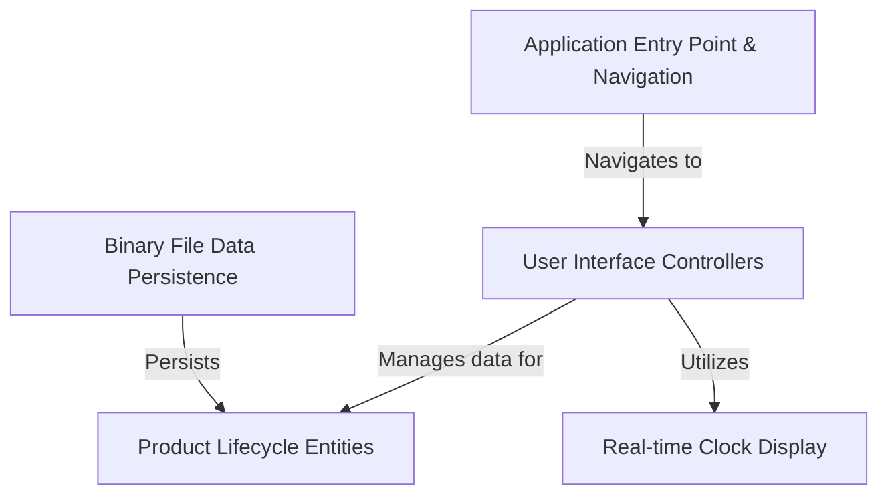

# Guarantee-Warranty_Tracker

The `Guarantee-Warranty Tracker` is an application designed to help a store *manage its product inventory* from when items are **newly added to stock** to when they are *sold* and even *returned*. It provides a user-friendly interface to **track product details** including warranty periods, and **safely saves all information** to files so nothing is lost, ensuring continuous tracking.

## Visual Overview

## Chapters

1. [Application Entry Point & Navigation
](01_application_entry_point___navigation_.md)
2. [User Interface Controllers
](02_user_interface_controllers_.md)
3. [Product Lifecycle Entities
](03_product_lifecycle_entities_.md)
4. [Binary File Data Persistence
](04_binary_file_data_persistence_.md)
5. [Real-time Clock Display
](05_real_time_clock_display_.md)
