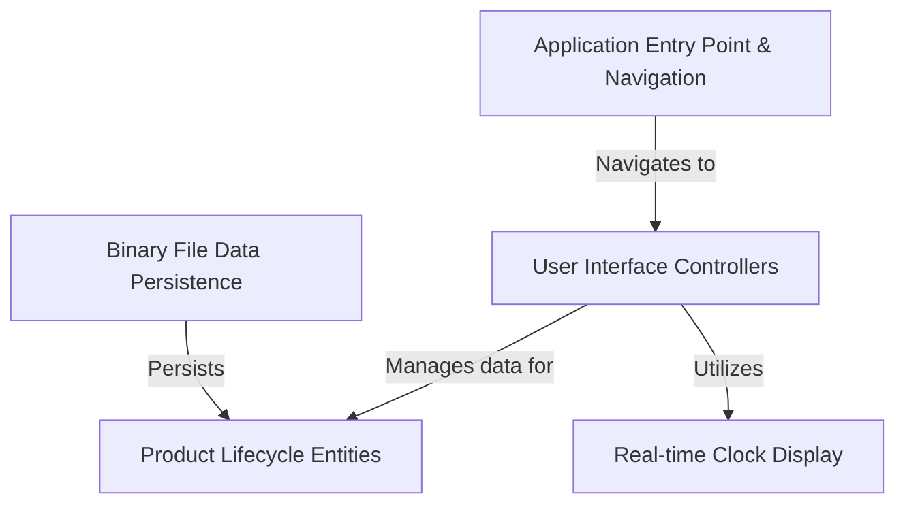
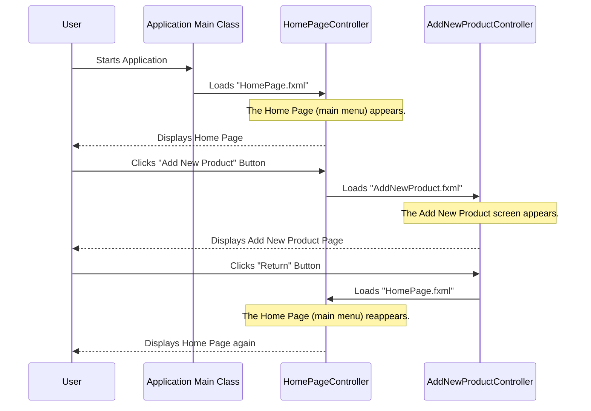
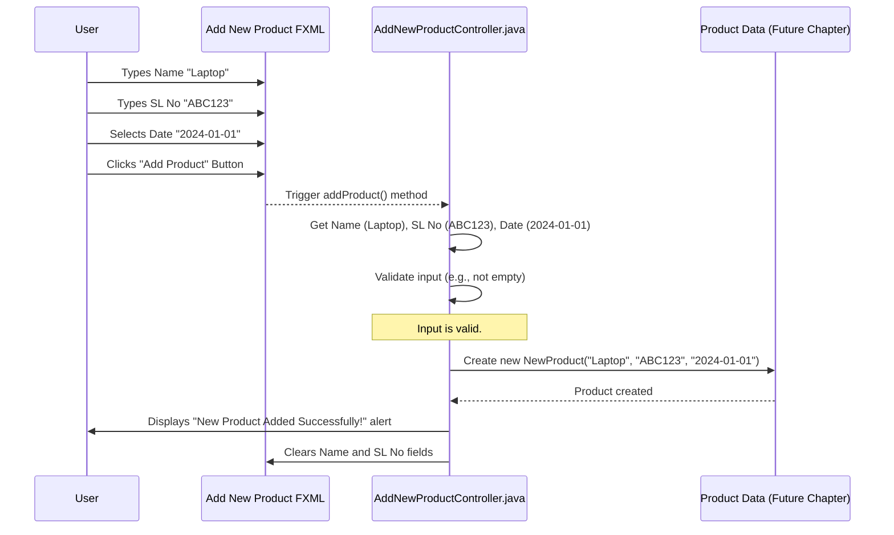
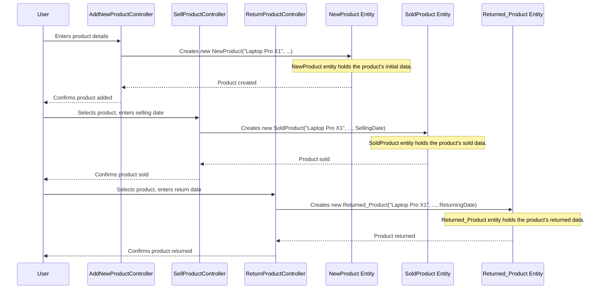
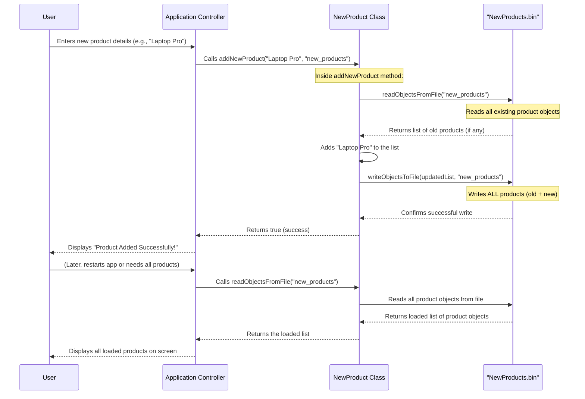
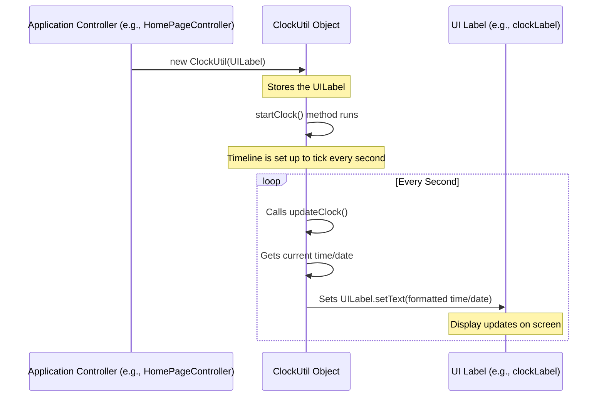

# Guarantee-Warranty_Tracker

The `Guarantee-Warranty Tracker` is an application designed to help a store *manage its product inventory* from when items are **newly added to stock** to when they are *sold* and even *returned*. It provides a user-friendly interface to **track product details** including warranty periods, and **safely saves all information** to files so nothing is lost, ensuring continuous tracking.


## Visual Overview



# Chapter 1: Application Entry Point & Navigation

Imagine walking into a brand new store. How do you know where the main entrance is? And once you're inside, how do you find the specific sections you need, like electronics or customer service? Our "Guarantee-Warranty Tracker" application works in a very similar way.

This chapter will teach you about two crucial ideas:
1.  **Application Entry Point:** How the application officially starts. Think of it as pushing open the front door of the store.
2.  **Navigation:** How you move between different parts of the application, like walking from the main lobby to the "Add New Product" department, and then finding your way back.

Understanding these concepts is the very first step to using and building any software!

## The Front Door: Starting the Application

Every application needs a starting point. In our "Guarantee-Warranty Tracker," this starting point is handled by a special class called `Main`. It's the first bit of code that runs, setting everything up for you to interact with the application.

### Use Case: How to start the application
When you launch the program, you want it to open up and show you the main menu. This is achieved by the `Main` class.

### Code Example: `Main.java`

```java
// File: Guarantee-Warranty Tracker/src/main_pkg/Main.java
package main_pkg;

import javafx.application.Application;
import javafx.fxml.FXMLLoader;
import javafx.scene.Parent;
import javafx.scene.Scene;
import javafx.stage.Stage;

public class Main extends Application {

    @Override
    public void start(Stage stage) throws Exception {
        // This loads the design for our Home Page from a file named "HomePage.fxml"
        Parent root = FXMLLoader.load(getClass().getResource("HomePage.fxml"));

        // A Scene is like a canvas that holds all the visual parts
        Scene scene = new Scene(root);

        // The Stage is the main window of our application
        stage.setScene(scene); // We put our scene into the window
        stage.show();         // And then we show the window to the user
    }

    public static void main(String[] args) {
        // This is the standard way to launch a JavaFX application
        launch(args);
    }
}
```

*Explanation:*
The `main` method is where the program execution truly begins in Java. It calls `launch(args)`, which is a special command to start a JavaFX application (the technology used to build our app's visual parts). This, in turn, automatically calls the `start` method.

Inside the `start` method:
1.  `FXMLLoader.load(...)`: This line is super important! It tells the application to find a file named `HomePage.fxml`. This FXML file is like a blueprint that describes how our Home Page looks – where buttons are, what text is displayed, etc.
2.  `Scene scene = new Scene(root);`: We take that loaded blueprint (`root`) and put it into a `Scene`. Think of the `Scene` as the actual picture or content that will be shown.
3.  `stage.setScene(scene);` and `stage.show();`: Finally, we take our `Scene` and place it inside the application's main window (`stage`). Then, `stage.show()` makes the window appear on your screen.

This entire process is how the application opens its "front door" and immediately displays the Home Page, which is our central hub.

## The Central Hub & Moving Around: Navigation

Once the application is open and you see the Home Page, you need a way to go to different functions, like adding a product or checking returns. This is where **navigation** comes in.

### The Home Page: Your Main Lobby

The Home Page is controlled by the `HomePageController` class. It's like the main lobby of our store, presenting all the main options you can choose from.

### Use Case: Navigating to Add a New Product
Let's say you want to add a brand new product.
1.  You start the application (as explained above).
2.  You see the Home Page with a button like "Add New Product."
3.  You click that button.
4.  The application then shows you the "Add New Product" screen.

### Code Example: Going from Home Page to Add New Product

```java
// File: Guarantee-Warranty Tracker/src/main_pkg/HomePageController.java
package main_pkg;

import java.io.IOException;
import javafx.event.ActionEvent;
import javafx.fxml.FXML;
import javafx.fxml.FXMLLoader;
import javafx.scene.Parent;
import javafx.scene.Scene;
import javafx.scene.control.Button;
import javafx.stage.Stage;

public class HomePageController {
    @FXML
    private Button AddNewProduct; // This links to the button on our Home Page UI

    @FXML
    private void addNewProduct(ActionEvent event) {
        try {
            // Load the design for the "Add New Product" screen
            FXMLLoader loader = new FXMLLoader(getClass().getResource("AddNewProduct.fxml"));
            Parent root = loader.load();
            Scene scene = new Scene(root);

            // Get the current window (stage) that the Home Page is in
            Stage currentStage = (Stage) AddNewProduct.getScene().getWindow();
            // Replace the current scene with the new "Add New Product" scene
            currentStage.setScene(scene);
        } catch (IOException e) {
            e.printStackTrace(); // Always good to print errors if something goes wrong
        }
    }
    // ... other navigation methods for SellProduct, ReturnProduct, etc.
}
```

*Explanation:*
When you click the `AddNewProduct` button on the Home Page, the `addNewProduct` method runs:
1.  `FXMLLoader.load(getClass().getResource("AddNewProduct.fxml"));`: Similar to how `Main` loaded `HomePage.fxml`, this line loads the design for the "Add New Product" screen from its own FXML file.
2.  `Stage currentStage = (Stage) AddNewProduct.getScene().getWindow();`: This line finds the window that your application is currently running in.
3.  `currentStage.setScene(scene);`: Instead of opening a *new* window, we simply replace the `Scene` inside the *existing* window with the new "Add New Product" scene. This makes it look like the screen has changed.

This is how you move from the 'main lobby' to a specific 'department' in the store!

### Use Case: Returning to the Home Page
After you've added a product, you'll likely want to go back to the main menu to choose another action.
1.  You are on the "Add New Product" screen.
2.  You click a "Return" button.
3.  The application takes you back to the Home Page.

### Code Example: Returning to the Home Page

```java
// File: Guarantee-Warranty Tracker/src/main_pkg/AddNewProductController.java
package main_pkg;

import java.io.IOException;
import javafx.event.ActionEvent;
import javafx.fxml.FXML;
import javafx.fxml.FXMLLoader;
import javafx.scene.Parent;
import javafx.scene.Scene;
import javafx.scene.control.Button;
import javafx.stage.Stage;

public class AddNewProductController {
    @FXML
    private Button Return; // This links to the "Return" button on this screen

    @FXML
    private void Return(ActionEvent event) { // The method name is "Return" (capital R)
        try {
            // Load the design for the Home Page again
            FXMLLoader loader = new FXMLLoader(getClass().getResource("HomePage.fxml"));
            Parent root = loader.load();
            Scene scene = new Scene(root);

            // Get the current window (stage)
            Stage currentStage = (Stage) Return.getScene().getWindow();
            // Change the scene back to the Home Page
            currentStage.setScene(scene);
        } catch (IOException e) {
            e.printStackTrace();
        }
    }
    // ... other methods for adding products, etc.
}
```

*Explanation:*
When you click the `Return` button on the "Add New Product" screen, its `Return` method (note the capitalized 'R' matching its definition in the FXML) is executed. This code is very similar to the navigation from the Home Page: it loads the `HomePage.fxml` blueprint and replaces the current screen with it, effectively bringing you back to the main menu. This is like following the 'signposts' back to the 'main lobby'.

## How it All Works Together: A Visual Flow

Let's look at a simple diagram that shows the entire journey from starting the app, going to a specific page, and then returning home.



*Explanation:*
1.  The `User` starts the `Main` application.
2.  `Main`'s `start` method loads the `HomePage.fxml` and displays it.
3.  The `User` clicks the "Add New Product" button on the `HomePage`. This triggers a method in `HomePageController`.
4.  This method loads `AddNewProduct.fxml` and replaces the current screen with it.
5.  After interacting with the "Add New Product" screen, the `User` clicks the "Return" button. This triggers a method in `AddNewProductController`.
6.  This method loads `HomePage.fxml` again and replaces the current screen, bringing the user back to the main menu.

## Conclusion

In this first chapter, you've learned the basic structure of how our "Guarantee-Warranty Tracker" application begins and how you navigate through its different parts. We've seen:
*   The `Main` class as the application's entry point, like the front door of a store.
*   The `HomePageController` acting as the central hub or main lobby.
*   How clicking buttons on the Home Page loads new screens (departments) and how "Return" buttons bring you back to the Home Page.

This foundational knowledge of application flow is crucial for understanding how the different parts of the software connect.

Next, we'll dive deeper into these different sections of the application by exploring [User Interface Controllers](02_user_interface_controllers_.md). You'll learn more about what these controllers do and how they manage everything you see and interact with on each screen.

---

# Chapter 2: User Interface Controllers

Welcome back! In [Chapter 1: Application Entry Point & Navigation](01_application_entry_point___navigation_.md), you learned how our "Guarantee-Warranty Tracker" application starts up and how you move between its different screens, like navigating from the Home Page to the "Add New Product" screen. But what actually *happens* on those screens? How do they know what to display, or what to do when you click a button or type something?

That's where **User Interface Controllers** come in! This chapter will introduce you to these vital components, which are like the "brain" behind each screen of our application.

## The Brains Behind the Screens: What are UI Controllers?

Imagine your TV remote control. You press a button (like "Channel Up" or "Volume Down"), and the TV responds. The remote isn't the TV itself, but it sends instructions. In our application, each screen has a **User Interface Controller** that acts very much like that remote control.

These controller classes are the "brain" of each screen. They:
1.  **Listen** to your actions (clicking buttons, typing text).
2.  **Handle** the logic of what should happen next.
3.  **Display** information on the screen.
4.  **Coordinate** with the application's data (like product details) to save changes or retrieve information.

For example, when you were on the "Add New Product" screen in Chapter 1, the `AddNewProductController.java` was secretly working hard, waiting for you to do something!

## The Team: FXML and its Controller

In our application, every visual screen you see (like "Add New Product" or "Sell Product") is designed using a special type of file called an **FXML** file. Think of FXML as the blueprint or drawing of the screen – it describes where buttons, text boxes, and labels go.

But a blueprint doesn't *do* anything on its own. It needs instructions! That's where its corresponding **Controller** file comes in.

*   **FXML file:** `AddNewProduct.fxml` (Describes how the "Add New Product" screen looks.)
*   **Controller file:** `AddNewProductController.java` (Manages *what happens* on the "Add New Product" screen.)

This pair works together perfectly to create interactive screens.

## Use Case: Adding a New Product (The Controller's Role)

Let's revisit our "Add New Product" example. In Chapter 1, you learned how to navigate to this screen. Now, let's see how its controller makes it functional.

When you're on the "Add New Product" screen, you want to:
1.  Type the **product's name**.
2.  Type its **serial number**.
3.  Select the **date**.
4.  Click an "**Add Product**" button.
5.  See a message confirming the product was added, or an error if something went wrong.

All of these interactions are managed by the `AddNewProductController.java`.

### Linking UI Elements with `@FXML`

How does the `AddNewProductController.java` know about the "Name" text field or the "Add Product" button that you see on the screen? It uses a special keyword called `@FXML`. This is like putting a special label on a part of your blueprint (`.fxml`) so your "brain" (`.java` controller) can find it.

Let's look at a snippet from `AddNewProduct.fxml` and `AddNewProductController.java` to see this in action:

--- File: Guarantee-Warranty Tracker/src/main_pkg/AddNewProduct.fxml ---
```xml
<!-- This is a text input field for the product's name -->
<TextField fx:id="NameTextField" layoutX="220.0" layoutY="107.0" prefHeight="25.0" prefWidth="209.0" />

<!-- This is the button to add a product -->
<Button layoutX="167.0" layoutY="246.0" mnemonicParsing="false" onAction="#addProduct" text="Add Product">
</Button>
```
*Explanation:*
*   `fx:id="NameTextField"`: This gives the text field a unique ID.
*   `onAction="#addProduct"`: This tells the button to run a method named `addProduct` when it's clicked.

Now, let's see how the controller "finds" these:

--- File: Guarantee-Warranty Tracker/src/main_pkg/AddNewProductController.java ---
```java
package main_pkg;

import javafx.event.ActionEvent; // Needed for button clicks
import javafx.fxml.FXML;         // Important for linking FXML elements
import javafx.scene.control.TextField; // Represents a text input box
import javafx.scene.control.Button;    // Represents a button

public class AddNewProductController {

    @FXML
    private TextField NameTextField; // Links to the TextField with fx:id="NameTextField"
    @FXML
    private Button Return;           // Links to the Button with fx:id="Return"

    @FXML
    private void addProduct(ActionEvent event) {
        // This method runs when the "Add Product" button is clicked
        // ... (logic for adding product will go here)
    }
    // ... other methods and variables
}
```
*Explanation:*
*   `@FXML`: This magical keyword tells JavaFX to connect the `TextField` variable `NameTextField` in your Java code to the `TextField` with `fx:id="NameTextField"` in your FXML file. It does the same for the `Return` button.
*   `@FXML private void addProduct(ActionEvent event)`: This links the `addProduct` method to the button's `onAction` event. When the button is clicked, this method automatically runs.

## How the Controller Handles Logic

Now that the controller is connected to the screen's elements, it can take action! Let's see how it gets user input, performs some checks, and gives feedback.

### Getting Input and Showing Messages

When you type into the `NameTextField` and `SlNoTextField` and select a date, the controller needs to grab that information. After processing, it might also show you an `Alert` message.

--- File: Guarantee-Warranty Tracker/src/main_pkg/AddNewProductController.java ---
```java
// ... (imports and @FXML variables from above)

public class AddNewProductController implements Initializable {
    @FXML private TextField NameTextField;
    @FXML private TextField SlNoTextField;
    @FXML private DatePicker DatePicker; // For selecting a date
    // ... other @FXML variables and methods

    @FXML
    private void addProduct(ActionEvent event) {
        // 1. Get user input from the screen elements
        String name = NameTextField.getText(); // Get text from Name field
        String number = SlNoTextField.getText(); // Get text from Serial Number field
        LocalDate date = DatePicker.getValue(); // Get the selected date

        // 2. Simple check: Is the name or serial number empty?
        if (name == null || name.trim().isEmpty() || number == null || number.trim().isEmpty()) {
            Alert errorAlert = new Alert(Alert.AlertType.ERROR);
            errorAlert.setContentText("Name or Serial Number cannot be empty!");
            errorAlert.showAndWait(); // Show an error message
            return; // Stop here if there's an error
        }

        // 3. If everything looks good, create a product and save it
        // This part involves more advanced concepts like creating a 'NewProduct' object
        // and saving it to a file. We'll cover these in later chapters!
        // For now, imagine a "magic" line of code that saves the product.

        // 4. Show a success message and clear the fields
        Alert successAlert = new Alert(Alert.AlertType.INFORMATION);
        successAlert.setHeaderText("New Product Added Successfully!");
        successAlert.setContentText("Product: " + name + ", SL No: " + number);
        successAlert.showAndWait();
        NameTextField.clear(); // Clear the text field
        SlNoTextField.clear(); // Clear the serial number field
    }
}
```
*Explanation:*
1.  `NameTextField.getText()`: This is how the controller reads what you typed into the "Name" text box. `DatePicker.getValue()` gets the date.
2.  `if (...) { Alert errorAlert = new Alert(...); }`: This checks if the input is valid. If not, it creates a small pop-up window (`Alert`) to tell you what went wrong.
3.  `Alert successAlert = new Alert(...)`: If everything is okay, it shows a different pop-up window confirming the product was added.
4.  `NameTextField.clear()`: This clears the text box, ready for the next product.

This simplified `addProduct` method shows how the controller handles what you type, checks it, gives you feedback, and prepares for the next action. It's the central point of control for this screen.

## How it All Works Together: A Controller's Flow

Let's visualize the steps a controller takes when you interact with a screen, using our "Add New Product" example.


*Explanation:*
1.  The `User` interacts with the visual elements on the `AddNewProductScreen` (which is defined by the FXML file).
2.  When the `User` clicks the "Add Product" button, the `AddNewProductScreen` (FXML) triggers the `addProduct()` method in its associated `AddNewProductController.java`.
3.  The `AddNewProductController` then reads the values from the input fields.
4.  It performs any necessary checks (like ensuring fields aren't empty).
5.  It then coordinates with other parts of the application (represented by `NewProductData` here, which we'll explore in [Chapter 3: Product Lifecycle Entities](03_product_lifecycle_entities_.md) and [Chapter 4: Binary File Data Persistence](04_binary_file_data_persistence_.md)) to actually save the new product's information.
6.  Finally, it gives feedback to the `User` by displaying an alert and updates the `AddNewProductScreen` by clearing the input fields.

## Conclusion

In this chapter, you've learned that **User Interface Controllers** are the intelligence behind each screen of our "Guarantee-Warranty Tracker" application. They are:
*   The "brains" that make screens interactive.
*   Connected to visual FXML files using `@FXML`.
*   Responsible for taking user input, validating it, and giving feedback.
*   Coordinating with other parts of the application (like saving data).

Understanding controllers is key to knowing how your actions translate into the application's responses. Next, we'll dive into *what* data these controllers are actually managing. Get ready to meet the core "things" in our application in [Chapter 3: Product Lifecycle Entities](03_product_lifecycle_entities_.md)!

---

# Chapter 3: Product Lifecycle Entities

Welcome back! In [Chapter 2: User Interface Controllers](02_user_interface_controllers_.md), we explored how the "brains" of our application's screens (the controllers) listen to your clicks and input. We saw how `AddNewProductController` was ready to take a product's name and serial number. But what exactly *is* a "product" in our application? How does the application remember all the details about it, especially as it moves through different stages like being new, sold, or even returned?

This chapter is all about understanding the fundamental "things" or "entities" that our application tracks: **Product Lifecycle Entities**. These are like the official forms or blueprints for a product at different points in its journey through your store.

## The Journey of a Product: Why Different Forms?

Imagine your store uses different colored forms for different situations:
*   A green form for a brand-new item arriving from the supplier.
*   A yellow form for an item that's just been sold to a customer.
*   A red form for an item that was sold, but then returned.

Each form needs specific information. The green form needs the buying date, but not the selling date. The yellow form needs both the buying and selling dates. The red form needs all that, plus the return date!

Our "Guarantee-Warranty Tracker" application works the same way. We need special "forms" or "blueprints" in our code to hold all the necessary information for a product, depending on its current status. These blueprints are called **Product Lifecycle Entities**.

## Our Product Blueprints: `NewProduct`, `SoldProduct`, `Returned_Product`

In our application, we have three main blueprints (classes) to represent a product at different stages of its "life cycle":

1.  **`NewProduct`**: This is the blueprint for an item that has just arrived in your stock. It's fresh, unused, and waiting to be sold.
2.  **`SoldProduct`**: This blueprint is used once an item from your stock is sold to a customer.
3.  **`Returned_Product`**: If a customer brings back an item they bought, this blueprint records all the details of that returned item.

Let's look at the key information each of these blueprints tracks:

| Entity              | Purpose                                | Key Information Tracked                            |
| :------------------ | :------------------------------------- | :------------------------------------------------- |
| `NewProduct`        | Item just added to store inventory     | Name, Serial Number, Buying Date                   |
| `SoldProduct`       | Item that has been sold to a customer  | Name, Serial Number, Buying Date, **Selling Date** |
| `Returned_Product`  | Item that was sold and then returned   | Name, Serial Number, Buying Date, Selling Date, **Returning Date** |

Notice how each stage adds more information. A `SoldProduct` includes everything from a `NewProduct` plus the `SellingDate`. A `Returned_Product` includes everything from a `SoldProduct` plus the `ReturningDate`. This ensures we keep a complete history for each item.

## Use Case: Tracking a Product's Journey

Let's follow a single product, a "Laptop Pro," through its journey in our application using these entities.

### Step 1: Adding a New Product

When you use the "Add New Product" screen (managed by `AddNewProductController` from Chapter 2), the information you type in is used to create a `NewProduct` object.

**Example Input:**
*   Name: "Laptop Pro X1"
*   Serial Number: "LPT-PRX-001"
*   Buying Date: January 15, 2024

**How it works (Simplified):**

```java
// File: Guarantee-Warranty Tracker/src/main_pkg/NewProduct.java (simplified for concept)
// ... (imports)

public class NewProduct {
    private String Name;
    private String Number; // This is the Serial Number
    private LocalDate Date; // This is the Buying Date

    // This is like filling out the "New Product" form!
    public NewProduct(String Name, String Number, LocalDate Date) {
        this.Name = Name;
        this.Number = Number;
        this.Date = Date;
    }

    // You can ask the form for its details later
    public String getName() { return Name; }
    public String getNumber() { return Number; }
    public LocalDate getDate() { return Date; }

    // ... other methods, including saving to file (Chapter 4)
}
```

*Explanation:*
The `NewProduct` class acts as a template. When you create a `new NewProduct(...)` object, you're essentially "filling out" a new product form with its name, serial number, and buying date. These pieces of information are stored inside that specific `NewProduct` object.

### Step 2: Selling the Product

Later, when a customer buys the "Laptop Pro X1," you would use the "Sell Product" screen. The application would then take the existing information from the `NewProduct` and combine it with the selling date to create a `SoldProduct` object. The `NewProduct` record might then be removed from the "in stock" list.

**Example Input:**
*   (From `NewProduct`): Name: "Laptop Pro X1", Serial Number: "LPT-PRX-001", Buying Date: January 15, 2024
*   Selling Date: February 10, 2024

**How it works (Simplified):**

```java
// File: Guarantee-Warranty Tracker/src/main_pkg/SoldProduct.java (simplified for concept)
// ... (imports)

public class SoldProduct {
    private String Name;
    private String Number;
    private LocalDate BuyingDate;
    private LocalDate SellingDate;

    // This is like filling out the "Sold Product" form!
    public SoldProduct(String Name, String Number, LocalDate BuyingDate, LocalDate SellingDate) {
        this.Name = Name;
        this.Number = Number;
        this.BuyingDate = BuyingDate;
        this.SellingDate = SellingDate;
    }

    // You can ask the form for its details later
    public String getName() { return Name; }
    public String getNumber() { return Number; }
    public LocalDate getBuyingDate() { return BuyingDate; }
    public LocalDate getSellingDate() { return SellingDate; }

    // ... other methods, including saving to file (Chapter 4)
}
```

*Explanation:*
A `SoldProduct` object takes all the details from the `NewProduct` and adds one more crucial piece of information: the `SellingDate`. This new object now represents the product in its "sold" state.

### Step 3: Returning the Product

If, unfortunately, the "Laptop Pro X1" is returned by the customer, you'd use the "Return Product" screen. This would then create a `Returned_Product` object, adding the return date to all the previous information.

**Example Input:**
*   (From `SoldProduct`): Name: "Laptop Pro X1", Serial Number: "LPT-PRX-001", Buying Date: January 15, 2024, Selling Date: February 10, 2024
*   Returning Date: February 15, 2024

**How it works (Simplified):**

```java
// File: Guarantee-Warranty Tracker/src/main_pkg/Returned_Product.java (simplified for concept)
// ... (imports)

public class Returned_Product {
    private String Name;
    private String Number;
    private LocalDate BuyingDate;
    private LocalDate SellingDate;
    private LocalDate ReturningDate;

    // This is like filling out the "Returned Product" form!
    public Returned_Product(String Name, String Number, LocalDate BuyingDate, LocalDate SellingDate, LocalDate ReturningDate) {
        this.Name = Name;
        this.Number = Number;
        this.BuyingDate = BuyingDate;
        this.SellingDate = SellingDate;
        this.ReturningDate = ReturningDate;
    }

    // You can ask the form for its details later
    public String getName() { return Name; }
    public String getNumber() { return Number; }
    public LocalDate getBuyingDate() { return BuyingDate; }
    public LocalDate getSellingDate() { return SellingDate; }
    public LocalDate getReturningDate() { return ReturningDate; }

    // ... other methods, including saving to file (Chapter 4)
}
```

*Explanation:*
The `Returned_Product` object completes the cycle, holding all the data from its buying date through its selling date, and finally its returning date. Each of these classes (`NewProduct`, `SoldProduct`, `Returned_Product`) is a separate, well-defined container for product data at a specific point in its lifecycle.

## How it All Works Together: The Product's Lifecycle Flow

Let's visualize the journey of our "Laptop Pro X1" and how different controllers (from Chapter 2) interact with these product entities.



*Explanation:*
1.  The `User` interacts with the `AddNewProductController` to add a new product.
2.  The `AddNewProductController` then creates an instance of the `NewProduct` entity, filling it with the initial details.
3.  Later, the `User` interacts with the `SellProductController`. This controller uses the initial `NewProduct` details (or retrieves them) and adds the `SellingDate` to create a `SoldProduct` entity.
4.  Finally, if the product is returned, the `User` interacts with the `ReturnProductController`. This controller takes all the previous information and adds a `ReturningDate` to create a `Returned_Product` entity.

Each entity acts as a specific snapshot of the product's data at that stage of its life.

## Internal Implementation: The Data Holders

The `.java` files for `NewProduct`, `SoldProduct`, and `Returned_Product` are primarily designed to be simple containers for data. They are known as **Plain Old Java Objects (POJOs)**.

Let's look at the core structure of each, focusing on the data they hold:

### `NewProduct.java` - The Foundation

This class defines the basic information for any item just added to your inventory.

```java
// File: Guarantee-Warranty Tracker/src/main_pkg/NewProduct.java
package main_pkg;

import java.io.Serializable; // Important for saving to files
import java.time.LocalDate;   // To store dates like "January 15, 2024"

public class NewProduct implements Serializable {
    private static final long serialVersionUID = 1L; // For saving

    private String Name;
    private String Number; // This represents the Serial Number
    private LocalDate Date; // This represents the Buying Date

    public NewProduct(String Name, String Number, LocalDate Date) {
        this.Name = Name;
        this.Number = Number;
        this.Date = Date;
    }

    // Methods to get the data (called "getters")
    public String getName() { return Name; }
    public String getNumber() { return Number; }
    public LocalDate getDate() { return Date; }

    // ... (other methods for setting data or handling file operations,
    // which we will cover in Chapter 4)
}
```
*Explanation:*
*   `implements Serializable`: This is a technical detail that tells Java this object *can be saved to a file* and read back later. We'll dive into this in [Chapter 4: Binary File Data Persistence](04_binary_file_data_persistence_.md).
*   `private String Name;`, `private String Number;`, `private LocalDate Date;`: These are the "variables" that hold the actual product name, serial number, and buying date. `private` means they can only be directly accessed within this class.
*   `public NewProduct(...)`: This is the **constructor**. It's a special method called when you create a `new NewProduct(...)` object, and it's responsible for setting up the initial values.
*   `public String getName()`: These are **getter methods**, which allow other parts of the application to safely read the values stored in this object.

### `SoldProduct.java` - Adding Sale Details

This class extends the idea of `NewProduct` by adding the `SellingDate`.

```java
// File: Guarantee-Warranty Tracker/src/main_pkg/SoldProduct.java
package main_pkg;

import java.io.Serializable;
import java.time.LocalDate;

public class SoldProduct implements Serializable {
    private static final long serialVersionUID = 1L;

    private String Name;
    private String Number;
    private LocalDate BuyingDate;
    private LocalDate SellingDate; // New information added here!

    public SoldProduct(String Name, String Number, LocalDate BuyingDate, LocalDate SellingDate) {
        this.Name = Name;
        this.Number = Number;
        this.BuyingDate = BuyingDate;
        this.SellingDate = SellingDate;
    }

    // Getters for all fields, including the new SellingDate
    public String getName() { return Name; }
    public String getNumber() { return Number; }
    public LocalDate getBuyingDate() { return BuyingDate; }
    public LocalDate getSellingDate() { return SellingDate; }

    // ... (other methods, including file operations for Chapter 4)
}
```
*Explanation:*
This class is very similar to `NewProduct` but includes an additional `SellingDate` variable in its constructor and as a field. It stores all the information needed for a product that has been sold.

### `Returned_Product.java` - Completing the Cycle

This class further extends the concept to include the `ReturningDate`.

```java
// File: Guarantee-Warranty Tracker/src/main_pkg/Returned_Product.java
package main_pkg;

import java.io.Serializable;
import java.time.LocalDate;

public class Returned_Product implements Serializable {
    private static final long serialVersionUID = 1L;

    private String Name;
    private String Number;
    private LocalDate BuyingDate;
    private LocalDate SellingDate;
    private LocalDate ReturningDate; // New information added here!

    public Returned_Product(String Name, String Number, LocalDate BuyingDate, LocalDate SellingDate, LocalDate ReturningDate) {
        this.Name = Name;
        this.Number = Number;
        this.BuyingDate = BuyingDate;
        this.SellingDate = SellingDate;
        this.ReturningDate = ReturningDate;
    }

    // Getters for all fields, including the new ReturningDate
    public String getName() { return Name; }
    public String getNumber() { return Number; }
    public LocalDate getBuyingDate() { return BuyingDate; }
    public LocalDate getSellingDate() { return SellingDate; }
    public LocalDate getReturningDate() { return ReturningDate; }

    // ... (other methods, including file operations for Chapter 4)
}
```
*Explanation:*
Similarly, `Returned_Product` builds upon the previous classes by adding the `ReturningDate`. It represents a product that has gone through the full cycle: bought by the store, sold to a customer, and then returned.

These three classes are the backbone of our data tracking. They ensure that every piece of information about a product, at every stage, is neatly organized and ready to be used by the application's controllers.

## Conclusion

In this chapter, you've learned about the core **Product Lifecycle Entities** in our "Guarantee-Warranty Tracker" application:
*   `NewProduct`: For items just added to stock.
*   `SoldProduct`: For items that have been sold.
*   `Returned_Product`: For items that were sold and then returned.

You've seen how these classes act as blueprints or data containers, each designed to hold specific information relevant to a product's stage. Understanding these entities is crucial because they define *what* data our application is actually managing.

Now that we know *what* data we're tracking, the next big question is: how do we save this data so it's not lost when we close the application? That's what we'll explore in [Chapter 4: Binary File Data Persistence](04_binary_file_data_persistence_.md)!

---

# Chapter 4: Binary File Data Persistence

Welcome back! In [Chapter 3: Product Lifecycle Entities](03_product_lifecycle_entities_.md), you learned about the `NewProduct`, `SoldProduct`, and `Returned_Product` blueprints that hold all the important details about our products. These blueprints allow our application's controllers (from [Chapter 2: User Interface Controllers](02_user_interface_controllers_.md)) to manage product data while the application is running. But what happens to all that valuable information when you close the application? Does it just vanish? If it did, you'd have to re-enter everything every single time you opened the app, which would be a huge headache!

This is where **data persistence** comes in. It's the ability of an application to *remember* its data even after it's been shut down and restarted. Think of it like saving your document to your computer's hard drive so you can open it again later.

## The Problem: Data Disappears!

Imagine you've spent hours adding new products to your "Guarantee-Warranty Tracker." You click the "Add Product" button, and everything looks great on screen. Then, you close the application. If the data isn't *persisted* (saved somewhere), all that hard work is lost forever. The next time you open the app, it will be completely empty. This is definitely not what we want!

## The Solution: Binary Files – Your Special Filing Cabinet

Our goal for this chapter is to understand how the `Guarantee-Warranty Tracker` application saves all your product information (those `NewProduct`, `SoldProduct`, and `Returned_Product` objects) to special files and loads it back. This way, you never lose track of your inventory.

Imagine each `NewProduct` object is like a perfectly organized toy car, with its name, serial number, and buying date clearly labeled. When you close the application, we don't want these toy cars to disappear! We need to put them away in a special storage box. This 'special storage box' is our **binary file**, usually ending with the `.bin` extension.

These `.bin` files are like a specialized filing cabinet where product objects are stored and retrieved in a highly efficient, "shrink-wrapped" format. All these files are kept in a dedicated folder on your computer: `Z:\My Drive\Sohel Computer & Service Center\` (this is a fixed directory in our application).

### Shrink-Wrapping Objects: Serialization

But before we put the toy car into the `.bin` box, we first need to 'shrink-wrap' it perfectly so it fits nicely and doesn't get damaged. This 'shrink-wrapping' process is called **serialization**. It converts our complex Java `NewProduct` object (or `SoldProduct`, `Returned_Product`) into a stream of bytes that can be easily written to a file.

To tell Java that an object *can* be shrink-wrapped, we add a special marker to its class definition: `implements Serializable`.

**Code Example: Making a `NewProduct` Serializable**

```java
// File: Guarantee-Warranty Tracker/src/main_pkg/NewProduct.java
package main_pkg;

import java.io.Serializable; // 1. Import this important tool
import java.time.LocalDate;

public class NewProduct implements Serializable { // 2. Add 'implements Serializable' here
    private static final long serialVersionUID = 1L; // 3. A special version stamp

    private String Name;
    private String Number;
    private LocalDate Date;

    public NewProduct(String Name, String Number, LocalDate Date) {
        this.Name = Name;
        this.Number = Number;
        this.Date = Date;
    }

    // ... (other methods like getters and setters would be here, as seen in Chapter 3)
}
```
*Explanation:*
1.  `import java.io.Serializable;`: This line brings in the necessary tool to mark our class.
2.  `public class NewProduct implements Serializable`: By adding `implements Serializable` to the class definition, we're telling Java, "Hey, objects of this `NewProduct` type can be turned into a stream of bytes and saved!" It's like putting a "handle with care, can be stored" sticker on your toy car.
3.  `private static final long serialVersionUID = 1L;`: This is like a version number for your sticker. It helps Java know if the saved data matches the current blueprint of the class.

All our product entity classes (`NewProduct`, `SoldProduct`, `Returned_Product`) have `implements Serializable` so they can be saved.

### The Packing & Unpacking Crew: Object Streams

To do the actual shrink-wrapping (serialization) and unwrapping (deserialization), we use special tools in Java called **Object Streams**:

*   **`ObjectOutputStream`**: This is like the 'packing machine' that takes your `Serializable` product objects, shrink-wraps them, and writes them into the `.bin` file.
*   **`ObjectInputStream`**: This is the 'unpacking machine' that reads the shrink-wrapped data from the `.bin` file, unwraps it, and turns it back into a live Java object (`NewProduct`, `SoldProduct`, etc.) that your application can use.

## The Filing Cabinet's Helper Methods

These packing and unpacking operations are so important that we put them as special helper methods directly inside our product entity classes (`NewProduct.java`, `SoldProduct.java`, `Returned_Product.java`). These are called **static methods** because they belong to the *class* itself (e.g., `NewProduct` class), not to a specific `NewProduct` object. They act like diligent filing clerks who know exactly how to handle the `.bin` files.

They always save and load from the `DIRECTORY = "Z:\\My Drive\\Sohel Computer & Service Center\\";` folder.

Let's look at some of these key methods found in `NewProduct.java` (similar methods exist in `SoldProduct.java` and `Returned_Product.java`):

### 1. Finding the Right File: `getFullPath`

This small helper makes sure we're always looking in the correct folder and using the right file name.

**Code Example: `getFullPath`**

```java
// Inside NewProduct.java (similar methods are in SoldProduct and Returned_Product)
private static final String DIRECTORY = "Z:\\My Drive\\Sohel Computer & Service Center\\";

// This method gets the full path for our .bin file and makes sure the folder exists
private static String getFullPath(String fileName) {
    if (!fileName.endsWith(".bin")) { // If the name doesn't end with .bin, add it
        fileName += ".bin";
    }
    File dir = new File(DIRECTORY);
    if (!dir.exists()) { // If the main directory doesn't exist, create it
        dir.mkdirs();
    }
    return DIRECTORY + fileName; // Returns something like "Z:\...\MyProducts.bin"
}
```
*Explanation:*
This `getFullPath` method is like telling the filing clerk where to find or create the correct file. It ensures the file name always ends with `.bin` and that the main storage directory exists before we try to save anything.

### 2. Packing and Saving: `writeObjectsToFile`

This method takes a list of objects and saves them into a `.bin` file.

**Code Example: `writeObjectsToFile`**

```java
// Inside NewProduct.java (similar methods are in SoldProduct and Returned_Product)
public static boolean writeObjectsToFile(List<Object> objects, String fileName) {
    String fullPath = getFullPath(fileName); // Get the full path for the file
    try (FileOutputStream fos = new FileOutputStream(fullPath); // Open a path to write to the file
         ObjectOutputStream oos = new ObjectOutputStream(fos)) { // Our "packing machine"
        for (Object obj : objects) {
            oos.writeObject(obj); // "Pack" (serialize) and write each object
        }
        return true; // Success! All objects saved.
    } catch (IOException ex) {
        ex.printStackTrace(); // Oh no, something went wrong saving!
        return false;
    }
}
```
*Explanation:*
This method opens a connection to the specified `.bin` file (`FileOutputStream`), then wraps it with an `ObjectOutputStream`. It then goes through the `objects` list one by one, calling `oos.writeObject(obj)` to serialize and save each object into the file.

### 3. Unpacking and Loading: `readObjectsFromFile`

This method reads all the saved objects from a `.bin` file and turns them back into usable Java objects.

**Code Example: `readObjectsFromFile`**

```java
// Inside NewProduct.java (similar methods are in SoldProduct and Returned_Product)
public static List<Object> readObjectsFromFile(String fileName) {
    List<Object> objects = new ArrayList<>(); // A list to hold our unpacked objects
    String fullPath = getFullPath(fileName); // Get the full path for the file

    File file = new File(fullPath);
    if (!file.exists()) return objects; // If file doesn't exist, return an empty list

    try (FileInputStream fis = new FileInputStream(fullPath); // Open path to read from file
         ObjectInputStream ois = new ObjectInputStream(fis)) { // Our "unpacking machine"
        while (true) { // Keep reading until the end of the file
            try {
                Object obj = ois.readObject(); // "Unpack" (deserialize) an object
                if (obj != null) {
                    objects.add(obj); // Add the unpacked object to our list
                }
            } catch (EOFException e) {
                break; // We've reached the end of the file, stop reading
            }
        }
    } catch (IOException | ClassNotFoundException ex) {
        ex.printStackTrace(); // Something went wrong loading!
    }
    return objects; // Return all loaded objects
}
```
*Explanation:*
This method is the opposite of `writeObjectsToFile`. It opens a connection to read from the `.bin` file (`FileInputStream`), then uses an `ObjectInputStream` to `readObject()` repeatedly. Each `readObject()` call unwraps a saved object. It continues until it hits the end of the file (`EOFException`), collecting all the objects into a list.

## Using the Filing Cabinet: Saving and Updating Products

Now that we have our `readObjectsFromFile` and `writeObjectsToFile` tools, we can use them to manage our product data.

### Use Case: Adding a Brand New Product

When you add a new product using the "Add New Product" screen (from [Chapter 2: User Interface Controllers](02_user_interface_controllers_.md)), the controller calls a method that saves this new `NewProduct` object. To do this, we usually:
1.  Read all existing products from the file.
2.  Add the new product to the list.
3.  Write the entire updated list back to the file.

The `addNewProduct` method in `NewProduct.java` simplifies this process for us.

**Code Example: `addNewProduct`**

```java
// Inside NewProduct.java
public static boolean addNewProduct(NewProduct item, String fileName) {
    // 1. Read all existing products from the file (using our helper)
    List<Object> products = readObjectsFromFile(fileName);
    // 2. Add the new product (the 'item') to the list in memory
    products.add(item);
    // 3. Write the entire updated list (old + new products) back to the file
    return writeObjectsToFile(products, fileName); // Returns true if saving was successful
}
```
*Explanation:*
This method is a simple helper for adding a single new product. It first loads *all* existing `NewProduct` objects from the file, adds the `item` you just created, and then saves the *entire updated list* back to the file. This way, your new product is safely stored alongside the old ones.

### Use Case: Updating Many Products or Saving All Changes

Sometimes you might edit an existing product, delete one, or make many changes. Instead of individually saving each change, it's often easier to completely replace the old version of the file with the new, updated list of products that's currently in your application's memory. The `updateFile` method handles this.

**Code Example: `updateFile`**

```java
// Inside NewProduct.java (similar methods are in SoldProduct and Returned_Product)
public static void updateFile(ObservableList<NewProduct> products, String fileName) {
    String fullPath = getFullPath(fileName); // Get the full path
    try (ObjectOutputStream output = new ObjectOutputStream(new FileOutputStream(fullPath))) {
        for (NewProduct product : products) {
            output.writeObject(product); // Write each product, completely replacing old file content
        }
    } catch (IOException e) {
        e.printStackTrace(); // Something went wrong updating the file!
    }
}
```
*Explanation:*
This `updateFile` method takes a whole list of `NewProduct` objects (typically the most current list in your application's memory) and completely overwrites the existing `.bin` file with them. This is useful for saving changes after many items have been added, removed, or modified in your application.

## How it All Works Together: The Data Persistence Flow

Let's visualize the journey of adding a new product and then loading all products back into the application.


*Explanation:*
1.  When the `User` wants to add a new product, the `Application Controller` (like `AddNewProductController`) tells the `NewProduct Class` to `addNewProduct`.
2.  The `NewProduct Class` first reads everything currently stored in the `DataFile`.
3.  It then adds the new product (`"Laptop Pro"`) to this list and writes the *entire updated list* back to the `DataFile`, overwriting the old content. This saves the new product.
4.  Later, when the application needs to show all products (e.g., at startup or to view a list), the `Application Controller` asks the `NewProduct Class` to `readObjectsFromFile`.
5.  The `NewProduct Class` reads all the shrink-wrapped product objects from the `DataFile`, unwraps them, and returns them to the `Application Controller` to be displayed.

## Conclusion

In this chapter, you've unlocked the secret to how our `Guarantee-Warranty Tracker` application *remembers* everything! You learned about:
*   **Binary files (`.bin`)**: The special filing cabinet for our product data.
*   **Serialization**: The process of 'shrink-wrapping' Java objects to save them.
*   **`ObjectOutputStream` and `ObjectInputStream`**: The tools for packing and unpacking objects.
*   **Static helper methods**: Like `readObjectsFromFile`, `writeObjectsToFile`, `addNewProduct`, and `updateFile` within our `NewProduct`, `SoldProduct`, and `Returned_Product` classes, which handle the heavy lifting of saving and loading data to a fixed directory.

Thanks to binary file data persistence, all the product information you carefully enter will be there waiting for you every time you open the application.

Next, we'll shift gears slightly and look at a smaller, but visually important feature: [Chapter 5: Real-time Clock Display](05_real_time_clock_display_.md), where you'll see how the application keeps track of time.

---

# Chapter 5: Real-time Clock Display

Welcome back! In [Chapter 4: Binary File Data Persistence](04_binary_file_data_persistence_.md), we learned how our "Guarantee-Warranty Tracker" application remembers all the important details about your products, even after you close and reopen it. That's about storing *what* happened. But sometimes, it's also important to know *when* something happened, and to have a consistent display of the current time across different parts of the application.

This chapter introduces a simple, but very useful, feature: the **Real-time Clock Display**. It's like having a little digital clock always visible on your application's screens, showing the current time and date. This helps you keep track of when you're adding, selling, or returning products, giving you consistent and up-to-date time information.

## The Problem: Keeping Track of Time

Imagine you're quickly adding new products or processing sales. While the date picker helps you select specific dates, wouldn't it be nice to always see the current time and date displayed prominently? This helps confirm that your actions are being recorded at the correct moment and provides a sense of the current real-world context within the application.

## The Solution: A Dedicated Clock Component

To solve this, we have a special helper component called `ClockUtil`. Think of `ClockUtil` as a small, smart clock that you can easily plug into any screen in our application. Once plugged in, it takes care of updating itself every second, ensuring the displayed time and date are always accurate.

### Use Case: Showing the Current Time on the Home Page

Let's say you open the application to the Home Page. You want to see the current day, date, and time right there, updating automatically. This is a perfect job for our `ClockUtil`.

### How it Works: Linking the Clock to Your Screen

To display the clock, you just need two things:

1.  A special area on your screen (like a `Label`) where the time will be shown.
2.  A command to tell `ClockUtil` to start ticking and update that `Label`.

Let's look at how the `HomePageController` (from [Chapter 1: Application Entry Point & Navigation](01_application_entry_point___navigation_.md) and [Chapter 2: User Interface Controllers](02_user_interface_controllers_.md)) does this.

**Code Example: `HomePageController.java`**

```java
// File: Guarantee-Warranty Tracker/src/main_pkg/HomePageController.java
package main_pkg;

import java.net.URL;
import java.util.ResourceBundle;
import javafx.fxml.FXML;
import javafx.fxml.Initializable;
import javafx.scene.control.Label; // Needed for the clock display

public class HomePageController implements Initializable {

    @FXML
    private Label clockLabel; // 1. This connects to a text area on our screen

    @Override
    public void initialize(URL url, ResourceBundle rb) {
        // 2. We create a new ClockUtil and tell it which Label to update
        ClockUtil clockUtil = new ClockUtil(clockLabel);
        // The clock starts ticking automatically!
    }    
    // ... other methods for navigation and buttons
}
```

*Explanation:*
1.  `@FXML private Label clockLabel;`: This line connects a `Label` (a simple text display area) in your Home Page's visual design (FXML file) to this variable in your Java code. This is where our clock will display the time.
2.  `ClockUtil clockUtil = new ClockUtil(clockLabel);`: Inside the `initialize` method (which runs when the screen first loads), we create a new `ClockUtil` object. We give it our `clockLabel` so it knows exactly where to put the time and date. As soon as `ClockUtil` is created, it starts its internal "ticking" process to update the label.

And that's it! With just these two lines, your Home Page will now show a continuously updating real-time clock. Other controllers, like `AddNewProductController` and `ReturnProductController`, use `ClockUtil` in exactly the same way to display the time on their respective screens.

## Internal Implementation: How `ClockUtil` Works Its Magic

Now, let's peek inside `ClockUtil.java` to see how it manages to keep track of time and update the `Label` every second.

### The `ClockUtil` Class: The Timekeeper

The `ClockUtil` class is designed to be simple and focused: its main job is to display the current time and date in a specific format on a given `Label`.

**Code Example: `ClockUtil.java`**

```java
// File: Guarantee-Warranty Tracker/src/main_pkg/ClockUtil.java
package main_pkg;

import javafx.animation.KeyFrame;
import javafx.animation.Timeline;
import javafx.scene.control.Label;
import javafx.util.Duration;
import java.text.SimpleDateFormat;
import java.util.Date;
import java.util.Locale;

public class ClockUtil {
    private final Label label; // The label we need to update

    public ClockUtil(Label label) {
        this.label = label; // Remember which label to use
        startClock();       // Start the clock when ClockUtil is created
    }
    // ... (other methods below)
}
```

*Explanation:*
*   `private final Label label;`: This variable holds a reference to the `Label` (like `clockLabel`) that was passed to `ClockUtil` when it was created. This is the display area it will update.
*   `public ClockUtil(Label label)`: This is the **constructor** for `ClockUtil`. When you write `new ClockUtil(clockLabel)`, this method runs. It stores the `label` and immediately calls `startClock()` to get the clock going.

### Starting the Automatic Tick: `startClock()`

The `startClock()` method is responsible for setting up a special timer that "ticks" every second.

**Code Example: `ClockUtil.java` (startClock method)**

```java
// Inside ClockUtil.java
// ... (constructor from above)

private void startClock() {
    // 1. Create a Timeline, which is like a timer.
    Timeline clockTimeline = new Timeline(
        // 2. Define what happens at each "tick": run updateClock()
        new KeyFrame(Duration.ZERO, e -> updateClock()),
        // 3. Define how often the "tick" happens: every 1 second
        new KeyFrame(Duration.seconds(1))
    );
    clockTimeline.setCycleCount(Timeline.INDEFINITE); // Keep ticking forever
    clockTimeline.play(); // Start the timer!
}
// ... (other methods below)
```

*Explanation:*
1.  `Timeline clockTimeline = new Timeline(...)`: A `Timeline` is a powerful tool in JavaFX for creating animations or, in our case, something that happens repeatedly over time. It's like setting up an alarm clock.
2.  `new KeyFrame(Duration.ZERO, e -> updateClock())`: This `KeyFrame` says: "At the very beginning (`Duration.ZERO`), and for every subsequent tick, run the `updateClock()` method."
3.  `new KeyFrame(Duration.seconds(1))`: This `KeyFrame` defines the duration of each "tick." Here, it's set to 1 second. So, `updateClock()` will run every second.
4.  `clockTimeline.setCycleCount(Timeline.INDEFINITE);`: This tells the `Timeline` to keep running forever, never stopping.
5.  `clockTimeline.play();`: This command starts the `Timeline`, making the clock begin its regular updates.

### Formatting and Displaying: `updateClock()`

The `updateClock()` method is called every second by the `Timeline`. Its job is to get the current time and date, format it nicely, and put it into the `Label`.

**Code Example: `ClockUtil.java` (updateClock method)**

```java
// Inside ClockUtil.java
// ... (startClock method from above)

private void updateClock() {
    // Tools to format date and time into a readable string
    SimpleDateFormat timeFormat = new SimpleDateFormat("h:mm:ss a"); // e.g., "3:05:22 PM"
    SimpleDateFormat dateFormat = new SimpleDateFormat("MMMM d, yyyy"); // e.g., "January 15, 2024"
    SimpleDateFormat dayFormat = new SimpleDateFormat("EEEE", Locale.ENGLISH); // e.g., "Monday"

    Date now = new Date(); // Get the current moment
    
    // Format the current moment into strings
    String timeString = timeFormat.format(now);
    String dateString = dateFormat.format(now);
    String dayString = dayFormat.format(now);

    // Combine them and put the final string into our label
    label.setText(dayString + ", " + dateString + ", " + timeString);
}
```

*Explanation:*
1.  `SimpleDateFormat`: This is a helper that lets us define *how* a date and time should look (e.g., "MMMM d, yyyy" means "Full month name, day of month, year"). We create different formatters for time, date, and day of the week.
2.  `Date now = new Date();`: This line gets the absolute current date and time from your computer's system.
3.  `timeFormat.format(now)`: This uses our formatter to turn the `Date` object (`now`) into a nicely formatted string (e.g., "3:05:22 PM").
4.  `label.setText(...)`: Finally, all the formatted strings are combined into one single string and set as the text for our `label`, updating what you see on the screen.

## How it All Works Together: The Clock's Flow

Let's visualize the simple yet powerful interaction between a screen's controller and our `ClockUtil`.



*Explanation:*
1.  When an `Application Controller` (like `HomePageController`) loads, it creates a `ClockUtil` object, giving it the `UILabel` where the time should be displayed.
2.  The `ClockUtil` stores this `UILabel` and immediately calls its `startClock()` method.
3.  `startClock()` sets up an internal timer (`Timeline`) that is programmed to "tick" once every second.
4.  Each time the timer "ticks" (every second), it calls the `updateClock()` method within the `ClockUtil` object.
5.  `updateClock()` gets the current time and date, formats it into a nice string, and then updates the text of the `UILabel` on the screen. This cycle repeats indefinitely, ensuring the time display is always current.

## Conclusion

In this chapter, you've learned about the **Real-time Clock Display** in our application. You've seen:
*   Why it's useful to have a constantly updated clock on screen.
*   How easy it is to add this clock to any screen by simply creating a `ClockUtil` and passing it a `Label`.
*   The internal workings of `ClockUtil`, including how it uses `Timeline` to tick every second and `SimpleDateFormat` to format the date and time beautifully.

This small but effective component adds a professional touch to our application, ensuring users always have current time information at a glance.

---
